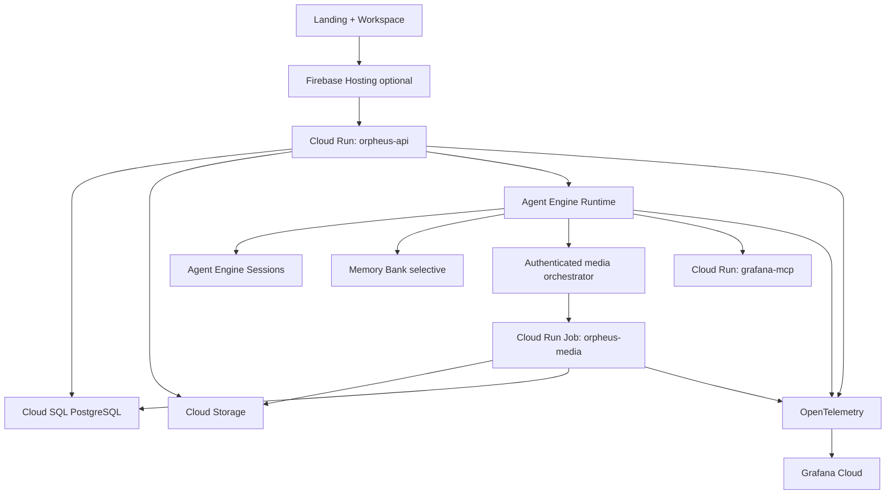

# Orpheus GCP architecture

Status: future deployment design. The current shipped baseline remains a local, single-user application. This document describes the GCP shape without claiming that the cloud migration is complete.

The design preserves the product contract in [`PRODUCT.md`](../PRODUCT.md): deterministic media processing, stateful ADK decisions, explicit paid work, human approval, redacted telemetry, and Grafana as an evidence plane.

## Decision

Use **Vertex AI Agent Engine Runtime** for the ADK agent, **Agent Engine Sessions** for agent history and state, **Cloud Run** for the application API and the private Grafana MCP adapter, **Cloud Run Jobs** for FFmpeg/NumPy processing, **Cloud SQL for PostgreSQL** for product records, **Cloud Storage** for media, and **Grafana Cloud** for observability.

Use **Memory Bank selectively** for explicit, durable user preferences. It is not a project database, media store, telemetry mirror, or automatic learning system.

Firebase Hosting is optional. Choose it for static frontend CDN, SSL, previews, and rollbacks. Otherwise Cloud Run can serve the compiled frontend and API together. Do not deploy the same frontend to both services.

## Logical layout

All application resources should start in one GCP region. Jakarta (`asia-southeast2`) is a reasonable default for an Indonesia-based operator, but the final region must be checked against Agent Engine, Cloud SQL, Firebase rewrite, and Grafana connectivity support.

## Service boundaries

| Service | Owns | Must not own |
| --- | --- | --- |
| Browser | Playback, recording, editing controls, review decisions initiated by the user | Provider keys, Grafana credentials, authoritative project state |
| `orpheus-api` on Cloud Run | Auth, project API, signed URLs, run creation, status, reviews, approval records, orchestration | Long-running media processing, raw agent secrets in responses |
| Agent Engine Runtime | ADK workflow, tool selection, bounded controller turns, evidence interpretation; post-contest provider failover | Large media files, human approval truth, permanent product records |
| Agent Engine Sessions | Agent event history, turn context, resumable workflow state | Raw video/WAV, candidate artifacts, relational product data |
| Memory Bank | Approved durable preferences and constraints | Every conversation event, telemetry, media, candidate history |
| `orpheus-media` Cloud Run Job | FFmpeg, NumPy, decoding, rendering, measurements, artifact writes | HTTP request serving, agent reasoning |
| `grafana-mcp` on Cloud Run | Unattended Grafana MCP calls using a scoped service-account token | Product records, media, model reasoning |
| Cloud SQL PostgreSQL | Projects, assets, runs, candidates, takes, reviews, hashes, job state, receipt references | Video/audio blobs, Grafana dashboards |
| Cloud Storage | Videos, source WAVs, rendered candidates, exports, runtime staging package | Secrets, relational state, editable approval logic |
| Grafana Cloud | Redacted logs, metrics, traces, cross-attempt evidence | Raw media, prompts, credentials, authoritative edits |
| Secret Manager | Vertex/Gemini, Grafana, and signing credentials; OpenRouter only in the post-contest product profile | Application data or user media |

## Agent Runtime, Sessions, and Memory Bank

An Agent Engine instance supports managed Sessions and Memory Bank. The ADK agent is deployed when Runtime is configured; creating the instance alone does not deploy an agent. See Google's [Agent Engine setup documentation](https://docs.cloud.google.com/vertex-ai/generative-ai/docs/agent-engine/memory-bank/set-up).

### Sessions

Sessions are required for Orpheus's multi-step inspect → map → fit → render → measure → revise workflow.

- Use one stable session identity per authenticated user and Orpheus project.
- Keep turn identity separate from session identity.
- Replace the local SQLite `DatabaseSessionService` with Agent Engine Sessions.
- Store only the product-level run and artifact references in Cloud SQL.
- Resume only a supported interrupted run; do not silently start a new paid turn.

Google exposes Sessions through the Agent Engine API and console. See [manage Sessions](https://docs.cloud.google.com/vertex-ai/generative-ai/docs/agent-engine/sessions/manage-sessions-api).

### Memory Bank

Memory Bank is a deliberate opt-in layer:

- Write only an explicit preference or constraint that is useful across runs.
- Scope retrieval by authenticated `user_id`; add `project_id` when a preference is project-specific.
- Show the user when a preference is saved, used, or deleted.
- Keep human approvals, candidate lineage, and evidence in Cloud SQL and Grafana receipts.
- Provide export and deletion handling for stored memories.

Do not use Memory Bank as a replacement for Sessions or as a dumping ground for ADK events. Memory retrieval is scope-based; see [fetch memories](https://cloud.google.com/vertex-ai/generative-ai/docs/agent-engine/memory-bank/fetch-memories).

Sessions and Memory Bank storage/operations are billable under the current pricing model from September 1, 2026. Memory generation and embedding tokens are billed separately. See [Agent Platform pricing](https://cloud.google.com/products/gemini-enterprise-agent-platform/pricing).

## Backend request flow

1. The browser authenticates and asks `orpheus-api` for a project or run.
2. The API creates a run record in Cloud SQL and returns short-lived signed URLs for media upload.
3. The browser uploads source media directly to Cloud Storage; buckets remain private.
4. The API starts or resumes the Agent Engine Session with the project and run identifiers.
5. Agent Runtime calls authenticated application tools. Those tools request a Cloud Run Job for deterministic media work.
6. The media job downloads from Cloud Storage, processes in temporary local disk, writes artifacts back to Cloud Storage, and records metadata in Cloud SQL.
7. The agent queries Grafana MCP for scoped history, sound, take, failure, or runtime evidence.
8. The agent may propose a bounded revision. The API exposes status by run ID through polling or a streaming endpoint.
9. The user auditions the actual candidate and explicitly approves or rejects its exact artifact hash.

Long work must be asynchronous. Cloud Run services have a finite request timeout, and Firebase Hosting rewrites to Cloud Run have a 60-second timeout. See [Cloud Run request timeout](https://docs.cloud.google.com/run/docs/configuring/request-timeout) and [Firebase Hosting with Cloud Run](https://firebase.google.com/docs/hosting/cloud-run).

Cloud Run Jobs fit FFmpeg/NumPy work because a job runs tasks and exits, with retries and task timeouts up to seven days. See [Cloud Run Jobs](https://cloud.google.com/run/docs/create-jobs).

## Data placement

### Cloud SQL PostgreSQL

Cloud SQL is not needed for Agent Engine Sessions. It is still the right source of truth for Orpheus product data:

- project and user ownership
- asset identities, hashes, and upload state
- runs, turns, candidates, and render versions
- recorded takes and lineage
- evidence receipt references
- human review and approval hashes
- job status, retries, deletion, and retention state

Keep the existing Cloud SQL instance if it is PostgreSQL. Do not add Firestore alongside it without a concrete query or scaling requirement. Cloud Run supports connecting to Cloud SQL; see [Cloud Run and Cloud SQL for PostgreSQL](https://docs.cloud.google.com/sql/docs/postgres/connect-instance-cloud-run).

Shared-core prices are useful for testing but are not a production availability choice: `db-f1-micro` is about `$0.0105/hour` and `db-g1-small` about `$0.035/hour`; shared-core types are outside the Cloud SQL SLA. See [Cloud SQL pricing](https://cloud.google.com/sql/pricing).

### Cloud Storage

Use separate private buckets:

- `orpheus-media`: source video, original WAV, recorded takes, rendered candidates
- `orpheus-runtime-staging`: Agent Runtime deployment package
- `orpheus-export`: optional user-requested exports

Use short-lived [signed URLs](https://cloud.google.com/storage/docs/access-control/signed-urls) for browser transfer. Add lifecycle rules for abandoned uploads and temporary candidates. Media egress to the user's browser is separate from at-rest storage and can dominate cost.

### Secrets and identity

Use separate service accounts for `orpheus-api`, Agent Runtime, `orpheus-media`, and `grafana-mcp`.

- The API can create signed URLs and update product records.
- Agent Runtime can call only the tools it needs and read scoped Grafana evidence.
- The media job can read/write the required bucket paths and update its run record.
- The browser never receives OpenRouter, Vertex, Grafana, or database credentials.

Store provider and Grafana credentials in [Secret Manager](https://docs.cloud.google.com/secret-manager/docs/best-practices), with separate versions and least-privilege access.

Keep the explicit provider adapter and failover for the post-contest product profile. The contest profile must call Google Gemini through the Google SDK/Agent Platform only; the Devpost rules prohibit other AI APIs, including OpenRouter. Do not ship the OpenRouter adapter in the public contest artifact. Preserve the same receipts and user consent when the post-contest profile is enabled.

## Grafana placement and contract

### Recommended: Grafana Cloud plus a private MCP adapter

Grafana Cloud is an external managed observability stack, not an application container. Export redacted OpenTelemetry metrics, logs, and traces from the API, Agent Runtime, and media job. Run the open-source [`grafana/mcp-grafana`](https://github.com/grafana/mcp-grafana) server as a private `grafana-mcp` Cloud Run service with a read-only Grafana service-account token. Agent Runtime calls this adapter over authenticated MCP.

The hosted endpoint (`https://mcp.grafana.com/mcp`) is useful for an interactive developer/demo connection, but its OAuth flow requires a browser and has no service-account or machine-token option. It is therefore not the server-to-server path for an unattended Agent Runtime deployment. See the [Grafana track authentication guidance](https://agentic-cinema.devpost.com/details/grafana-resources).

The application should link to Grafana for operational detail and query it for evidence. It must not imitate Grafana's UI or send raw audio, video, prompts, transcripts, or credentials. This follows the [Grafana boundary in the product contract](../PRODUCT.md#grafana-is-a-decision-input-not-decoration).

Grafana Cloud has a `$0` Free plan with limited retention and a Pro plan starting at `$19/month` plus usage. The 14-day unlimited trial is not an account expiry: Grafana says trial usage is not billed and the stack automatically moves to the Free plan when the trial ends. The Free plan keeps the 14-day retention and enforces its usage limits; older telemetry rolls out of the retention window. See [Grafana pricing](https://grafana.com/pricing/), [Grafana billing FAQ](https://grafana.com/docs/grafana-cloud/platform/cost-management-and-billing/manage-invoices/understand-your-invoice/), and [sending telemetry to Grafana Cloud](https://grafana.com/docs/grafana-cloud/observe-and-act/send-data/).

Keep Grafana Cloud's portal plan and Google Cloud Marketplace billing separate in deployment notes. A `Cloud Trial` badge in the Grafana portal does not prove that a Marketplace subscription is active. If Grafana is procured through Google Cloud Marketplace, record the exact consumer project and billing account; do not assume it is attached to the Firebase project. Verify the Marketplace order before enabling any paid subscription.

### Alternative: self-hosted Grafana

If a requirement forces the Grafana stack itself to remain in GCP, run Grafana on Compute Engine or GKE with persistent storage and keep `grafana-mcp` private. Keep the existing `observability/` Compose stack for local development only. Do not treat Cloud Run's ephemeral disk as Grafana's persistent database.

## Hackathon compliance gate

The [official rules](https://agentic-cinema.devpost.com/rules) add constraints that are stricter than the general product architecture:

- The submitted agent must be powered by Gemini and Google Cloud Agent Builder and must use the selected partner integration at runtime.
- Only Google Cloud AI tools and the chosen partner's built-in AI features are allowed. OpenRouter and every other external AI API must stay out of the submitted build, even as failover. Keep that adapter in a post-contest product profile or separate branch.
- The Grafana track checks an actual runtime MCP connection. AI Observability alone is not enough. The demo should show the agent querying live Grafana evidence and using the result in a decision.
- The submission needs a hosted project URL, a public open-source repository with an OSI-approved license, and a public English or subtitled demo video no longer than three minutes.
- The rules say the project must be newly created during the contest rather than an extension of existing work. Orpheus's eligibility needs an explicit date check before treating the current repository as the submission artifact.
- The contest deadline shown by Devpost is September 9, 2026 at 2:00 PM Pacific Time.

For the contest deployment, use `google-adk` and `google-genai` with the exact Gemini model identifier available in the selected Vertex/Agent Platform region. A Gemini Developer API/AI Studio free tier is not the same promise as a free Vertex AI deployment; verify the project billing and model availability before the parity run. See [Gemini Developer API pricing](https://ai.google.dev/gemini-api/docs/pricing) and [Agent Platform pricing](https://cloud.google.com/gemini-enterprise-agent-platform/generative-ai/pricing).

## Firebase Hosting decision

Firebase Hosting is useful for a static React/Vite build because it provides CDN delivery, SSL, previews, and rollbacks. It is not the Orpheus backend and it does not replace Cloud SQL, Cloud Storage, Agent Runtime, or Cloud Run.

Choose one frontend deployment:

1. Firebase Hosting for static landing/workspace assets, Cloud Run for `/api`.
2. Cloud Run serves static assets and the Python API together.

For the current private single-user target, option 2 has fewer moving parts. Use Firebase Hosting when global static delivery and preview channels justify the extra service. Hosting is no-cost up to 10 GB storage and 360 MB/day transfer, then usage charges apply. See [Firebase pricing](https://firebase.google.com/pricing/).

Do not add Firebase Authentication for the current private single-user deployment unless an actual external identity requirement appears. Add Identity Platform/Firebase Auth when multiple users, invitations, or account recovery are required.

## Two architecture choices

### A. Managed agent architecture — recommended

- Agent Engine Runtime hosts ADK.
- Agent Engine Sessions own agent history.
- Memory Bank stores only approved durable preferences.
- Cloud Run API owns application behavior.
- Cloud Run Job owns deterministic media processing.
- Cloud SQL and Cloud Storage own product data and media.
- Grafana Cloud owns observability and the private `grafana-mcp` adapter supplies MCP evidence.
- Firebase Hosting remains optional.

This best matches the future GCP contract and removes the local SQLite session dependency.

### B. Lean hosted architecture

- Cloud Run hosts the ADK runner.
- Managed Agent Engine Sessions remain the session store.
- Memory Bank starts disabled and is added only after a clear preference use case.
- Cloud Run Job, Cloud SQL, Cloud Storage, and Grafana Cloud remain the same.

This reduces managed-agent integration, but gives up Agent Engine Runtime. Use it only if service count or early cost matters more than the managed runtime requirement.

## Monthly planning estimate

These are planning bands, not an invoice quote. Assumptions: one region, 20 completed runs/month, 30 minutes of agent activity per run, a 10-minute 2-vCPU/4-GiB media job per run, 10–100 GB retained media, one user, and no large internet egress.

| Component | Small/private estimate | Notes |
| --- | ---: | --- |
| Cloud SQL shared-core | `$8–$26` | Test floor only; no SLA for shared-core types |
| Cloud SQL dedicated, 1 vCPU/4 GiB | `~$51` | Before storage, backup, and network charges |
| Cloud SQL dedicated HA | `~$101` | Compute portion; exact region/edition changes this |
| Agent Runtime compute | `$0` at this workload | Current pricing has 50 vCPU-hour and 100 GiB-hour monthly free tiers; above that is `$0.085/vCPU-hour` and `$0.009/GiB-hour` |
| Sessions + small Memory Bank | `<$1` typically | Storage/operations are low at this volume; generation tokens are separate |
| Cloud Run API + media Jobs | `$0–$5` | Likely within the monthly free compute tiers at this workload |
| Cloud Storage | `$0.30–$3` | Depends on region and retained media; egress is separate |
| Grafana Cloud Free | `$0` | Limited retention and ingestion |
| Grafana Cloud Pro | `$19+` | Usage is added to the platform fee |
| Firebase Hosting | `$0` at small traffic | Free limits apply before usage pricing |
| Secrets, logs, registry | `$0–$10` | Depends on retention and release frequency |

Model cost is the largest variable. Current standard Agent Platform prices list Gemini 2.5 Flash at `$0.30/M` input and `$2.50/M` output, and Gemini 2.5 Flash-Lite at `$0.10/M` input and `$0.40/M` output. Audio input has separate rates. See [Gemini pricing](https://cloud.google.com/gemini-enterprise-agent-platform/generative-ai/pricing).

| Model usage | Flash | Flash-Lite |
| --- | ---: | ---: |
| 1M input + 0.2M output per run × 20 runs | `$16/month` | `$3.60/month` |
| 5M input + 1M output per run × 20 runs | `$80/month` | `$18/month` |

If OpenRouter remains the active provider, replace this model line with the OpenRouter invoice. It is not a GCP model charge.

Practical monthly budgets:

- Test deployment with shared-core SQL: **`$10–$30`**
- Private production with dedicated SQL and Grafana Free: **`$60–$150`**, depending on model context
- Dedicated HA SQL, Grafana Pro, and heavier context: **`$130–$300+`**
- Public multi-user usage with media egress: **`$300+`**

Set a GCP budget alert before enabling paid inference. Long multimodal context, retained media, and browser downloads are more dangerous cost drivers than Sessions or Agent Runtime at low volume.

## Deliberately deferred services

Do not add these for the private single-user target:

- Firestore alongside Cloud SQL
- Redis or Memorystore
- GKE
- Pub/Sub or Cloud Tasks
- A second API service
- A second frontend hosting service

Add a queue when concurrent runs create real backpressure. Add a separate worker pool only when Cloud Run Jobs no longer provide sufficient isolation or throughput.

## Migration checkpoints

1. Confirm Cloud SQL PostgreSQL engine, region, backups, and private connectivity.
2. Create separate media and Agent Runtime staging buckets.
3. Deploy the ADK agent to Agent Engine Runtime and replace local SQLite Sessions.
4. Package FFmpeg/NumPy as the Cloud Run media Job.
5. Move project/artifact metadata from filesystem JSON to Cloud SQL; keep media in Cloud Storage.
6. Add signed upload/download URLs and authenticated run ownership.
7. Connect redacted OpenTelemetry to Grafana Cloud and configure read-only MCP.
8. Validate restart, cancellation, idempotency, stale evidence, deletion, and exact approval hashes.
9. Run one capped paid parity turn before expanding usage.

The migration is complete only when the deployed application proves session reload, artifact preservation, real MCP queries, provider failure behavior, and human-review provenance. Configuration presence alone is not proof.
